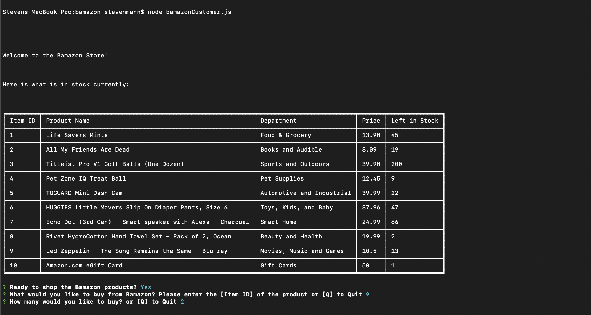
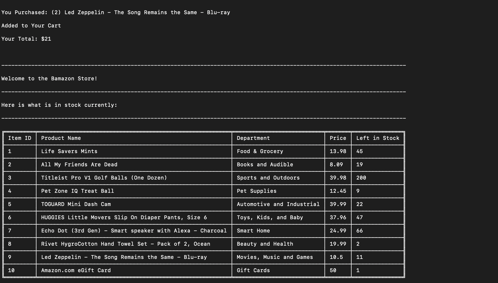
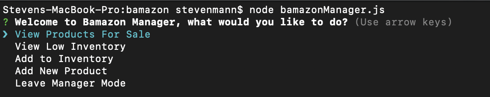
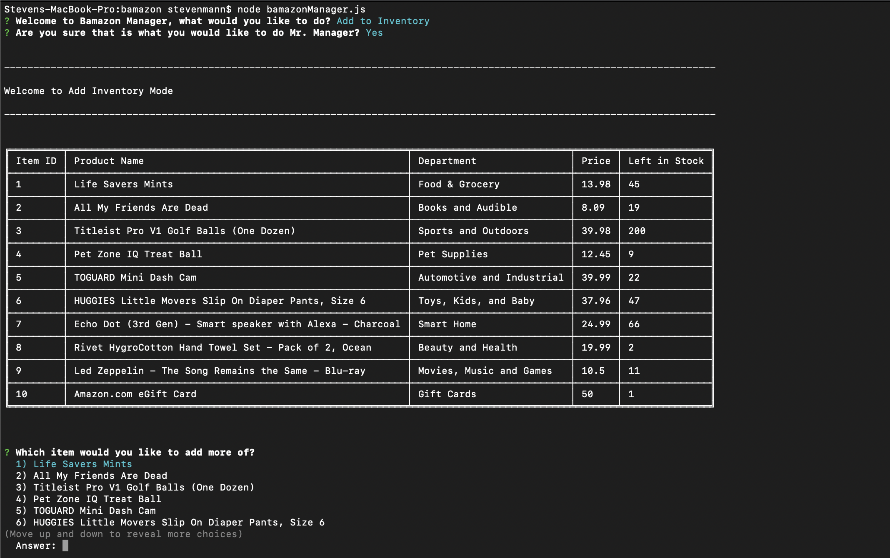

# bamazon
This Repo contains my first MYSQL project that will make a mock version of Amazon. 

**Project Summary**

This project is CLI app that functions as a mock Amazon product. Using MySQL and terminal commands, the user will be able to accomplish various tasks using only the command line and a MySQL database. 

**Developer**

Steven Mann:
Portfolio: https://stevencmann2.github.io/Responsive-Portfolio/
Github: https://github.com/stevencmann2
LinkedIn: https://www.linkedin.com/in/steven-mann-b54494a6/

**What languages is it written with? **

* Javascript
* MySQL
* Node.js
* Inquier npm package

**Instructions**
* Please clone my repository (https://help.github.com/en/github/creating-cloning-and-archiving-repositories/cloning-a-repository)
* npm install in your terminal 
* Run one of the following commands in the terminal 
 ** Bamazon Customer 
 ** Bamazon Manager 

**Future Development**

I woulld eventually like to complete the third and final use of the bamazon app, in supervisor mode. 

**Using the app:**

